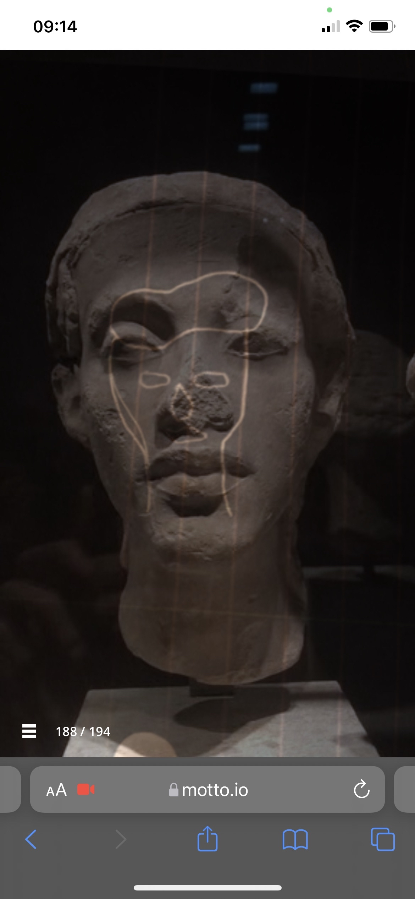
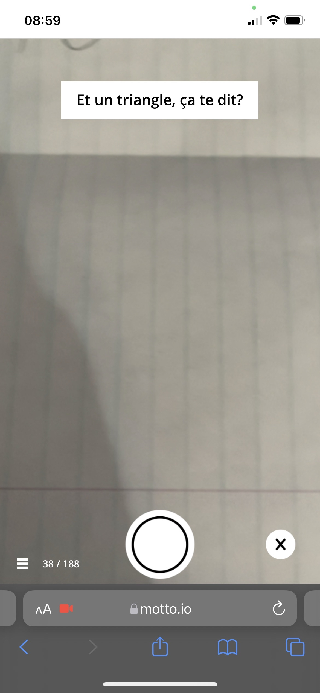

# Mon expérience de l'oeuvre :
J'ai fais l'experience de l'aventure Motto, imaginer par aatoaa, le 16 février 2021.  
  
L'expérience a été rendue diponible sur le web au cours de l'année 2020.  
J'ai bien aimé le conecept je me suis prêter au jeu plus que je ne l'aurais cru, j'ai tout donner quand est venue le moment de dessiner Septembre.  
  
Enfin, j'ai presque tout donner...  
l'histoire est intéressante à suivre que ce soit a l'extérieur ou à l'intérieur les actions qu'on nous demande de faire sont facile à réaliser, j'ai bien aimé.  
  

# Description de l'oeuvre :
Motto est une aventure extraordinaire et unique en son genre. Ce livre interactif, composé de milliers de petites vidéos, raconte le parcours millénaire d’un sympathique esprit nommé Septembre. À mi-chemin entre une histoire de fantôme et une chasse au trésor, Motto oscille entre le documentaire et la fiction, tissant les images créées par chaque participant dans la trame émotive de son récit. L’œuvre agit comme un prisme qui, par les multiples réfractions de l’imaginaire de tous les utilisateurs, transforme continuellement leur perception du monde. Cette description est tirée du site d'aatoaa. (https://aatoaa.com/fr.html)  

