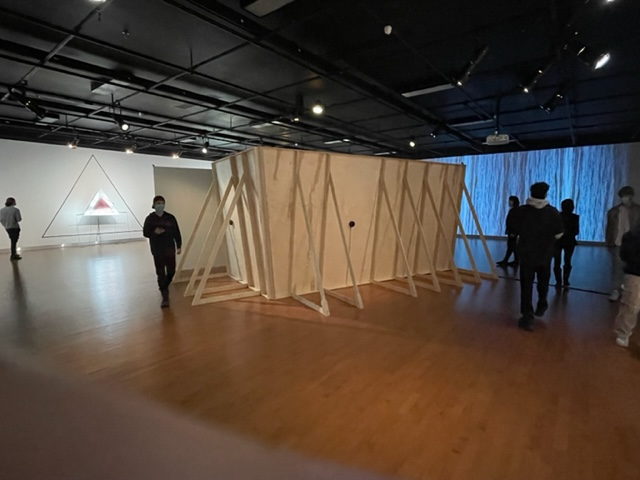
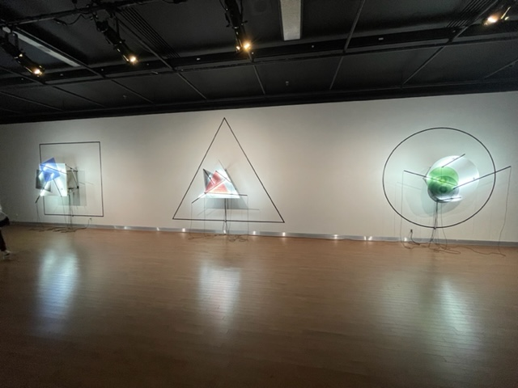
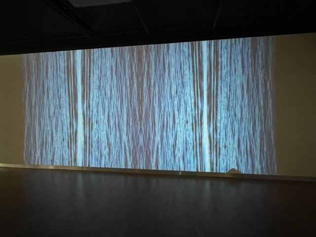
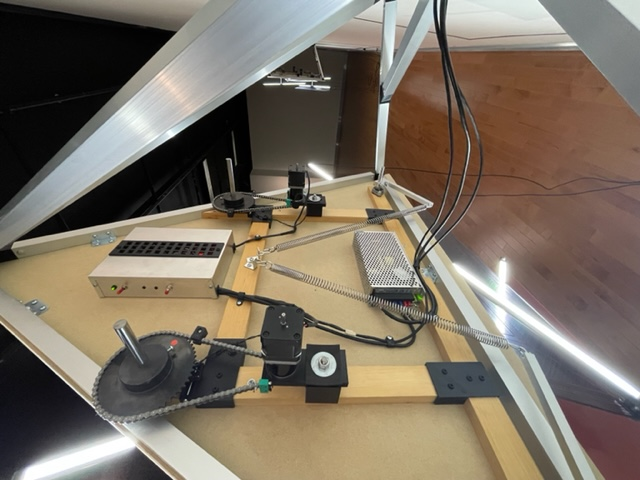
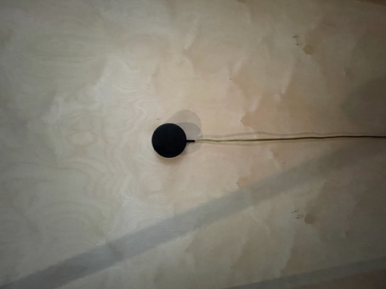
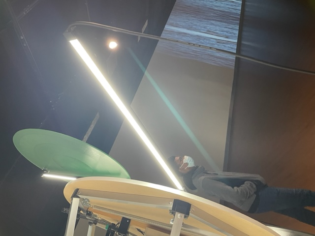
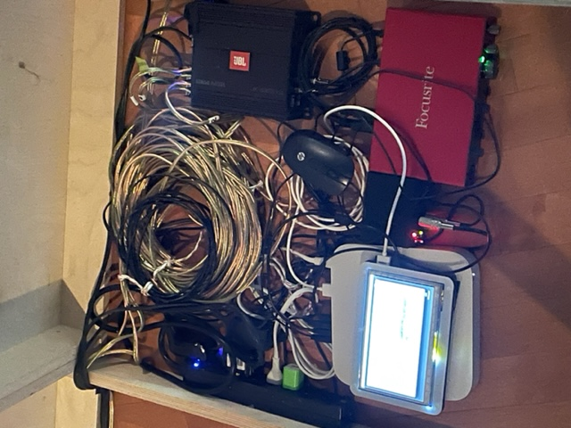

## Détail de l'oeuvre
J'ai visité l'exposition Configuration du sensible présenté par le duo Béchard Hudon le 16 mars 2022.  
L'oeuvre est présenté à la maison des art de laval depuis le 20 février 2022 et a pris fin le 16 avril de la même année.

## Mon expérience
j'ai réellement apprécier les 3 méchanismes géometrique sur le mur car ils sont vraiment captivent et agréables a regarder, l'effet que génère les plaques de verre quand elles se chevauches est vraiment hypnotisant puisque les motifs se croisent on à l'impression de voir d'autres formes complétement aléatoire et imaginaire se créer au sain des autres formes qui sont quant à elle bien réelle. La grande structure en bois était intriguante puisque qu'il y avait en plusieurs manière d'intérpreter le bruit qui résonnait à l'intérieur et apprendre qu'en fait il sagissait du bruit sous la terre étais inattendu. Cela dis, pour ce qui est en rapport avec la video des vagues, elle ne m'a pas interpellé plus que ça en comparaison avec les autres éléments.  

## Description de l'oeuvre
L'exposition Configurations du sensible présente leurs plus récentes productions, entre autres la série Mécanismes de dessaisissement (2019-2020), composée de 3 sculptures murales géométriques et cinétiques au fort potentiel vibratoire, et L'en deçà (2021), une imposante structure en bois aux consonances architecturales interagissant avec le public à travers de profondes modulations sonores. Si cette dernière pièce met de l'avant le paysage acoustique et tellurique de différents milieux naturels où le duo a mené des recherches de fond, d'autres œuvres misent sur des variations optiques qui témoignent implicitement d'une volonté de bousculer certains paradigmes sociaux afin de repenser nos manières de voir et d'agir. Dans l'ensemble, l'exposition convie à une réflexion sur « l'épaisseur du présent », entendu par la philosophe Isabelle Stengers comme l'expérience d'un temps non euclidien et non linéaire qui contribue à déconstruire les grandes divisions binaires. — A. S.  
*Cette description est tirée du site laval.ca à l'adresse suivante : (https://www.laval.ca/Pages/Fr/Calendrier/mda-expo-bechard-hudon.aspx)*

### Description technique de l'oeuvre
Ce projet est principalement une installation multimedia puisque on y retrouve beaucoup d'élément physique avec les quels on peut intéragir dans le monde réelle. Les 3 structures géométriques se trouve a la gauche du local en rentrant et sont retro éclairer par des neon cacher derrière les tige qui servent à faire tournoyer les formes. La grande structure en bois est créer de façon a rediriger le son vers un endroit souhaité afin que le son a l'intérieur de la structure est une bonne qualité sonore. Le son provient des petits haut parleur qui son coller contre les paroie extérieur du mur et qui sont relier a un syteme qui le fais jouer en boucle. la projection et projeter sur le mur au fond du local a l'aide d'un projecteur au plafond et alterne entre 2 video différente mais similaire. la majore partie de l'installation est relier avec des capteurs pour eviter son activation quand il n'y a personne.

### Ce qui est nécessaire pour l'expérience
Pour cette oeuvre absolument rien n'est nécessaire pour en faire l'experience, le simple fait d'être présent est bien suffisant.
