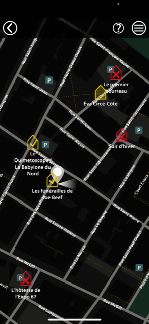

## Détail de l'oeuvre
J'ai visité Cité Mémoire créer par Michel Lemieux et Victor Pilon le 30 avril 2022.  
La création de l'oeuvre a débuté quand ils se sont rencontré en 1990.  
Le public peut obeserver librement les projections pendant les soirs de fin de semaine dans le secteur du vieu Montréal.  

## Mon expérience
Je trouve que c'est un projet vraiment pertinent car il permet à n'importe qui d'en apprendre un peu plus sur l'histoire de montréal d'une manière divertissante et agréable. j'ai bien apprécier que l'oeuvre soit vraiment simple d'utilisation puisque il suffit de s'approcher d'une oeuvre avec l'application d'ouverte pour qu'elle te propose elle même de s'installer et commencer. Cela dis, personnellement j'aurais éviter de positionnez une projection dans une ruelle vide ou personne ne passe puisque dans la plupart des cas les personnes, moi incluant, ne s'y aventurerons pas si ils sont seul.  

## Description de l'oeuvre
Librement inspirée de l’histoire de Montréal, Cité Mémoire vous convie à la rencontre d’une multitude de personnages témoins de l’évolution de la ville à travers le temps. Plus de vingt-cinq tableaux se déploient en images, en paroles et en musique, animés d’un souffle tantôt ludique, tantôt poétique. Dans le Vieux-Montréal, le Vieux-Port de Montréal et au Centre-ville, l’œuvre émerge à même les murs qui nous entourent, le sol que nous foulons, les arbres qui bercent notre présent.  
*Cette description est tirée du site de Cité Mémoire. (https://www.montrealenhistoires.com/cite_memoire/#oeuvre)* 

### Description technique de l'oeuvre

### Ce qui est nécessaire pour l'expérience
l'oeuvre n'est disponoble que de 20:15 à 23:00 les soirs de fin de semaine et vous aurez besoin d'installer l'application Montréal en histoire pour trouver et activer les différente projections qui se cache dans le vieu montréal. Vous devez également vous trouver a proximité d'une projection pour être en mesure de l'activer.  

