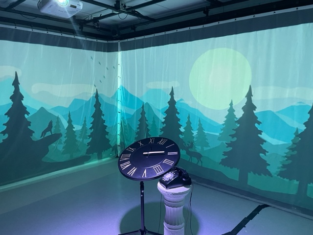
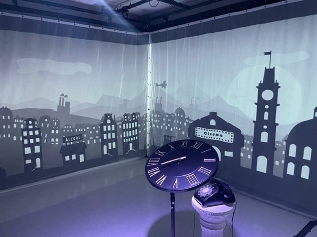
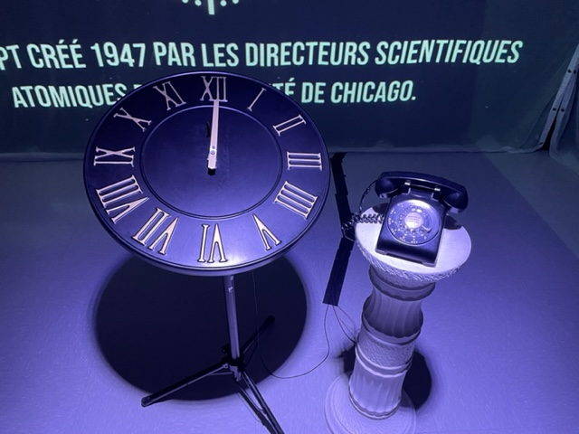
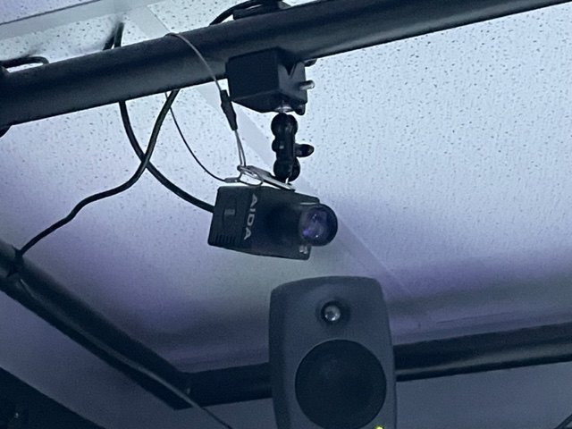
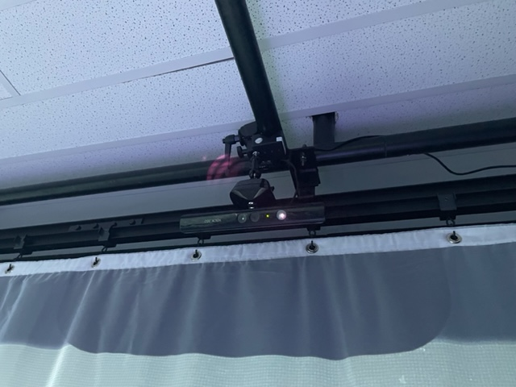
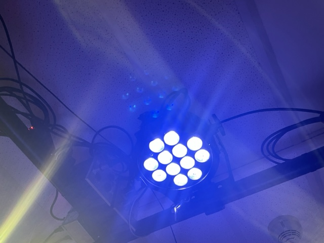

## Détail de l'oeuvre
J'ai visité l'exposition L'horloge de l'apocalypse créer par Maxime Sabourin, Louis-Philippe Gravel, Alexis Lacasse, Tristan Girard-Montpetit et Maxime De Falco le 23 mars 2022.  
l'oeuvre à été présenté pendant la semaine des art au collège montmorency durant la semaine du 21 au 25 mars.

## Mon expérience
J'ai bien aimé cet oeuvre, les illustrations etait magnifique et bien réalisé, la composition sonore correspondait bien au illustrations représenter et savoir que toutes les musiques présente dans se projet ont été réalisé par eux est d'autant plus impressionant.  

### Retour sur ordre de préférence
Comme prévue L'horloge de l'apocalypse à été mon coup de coeur le style des illustrations correspondait bien au style d'illustration qui me plait et mon faible pour les univers apocalyptique a du jouer dans la balance aussi.

## Description de l'oeuvre
horloge de l’apocalypse représente la ligne du temps de l’humanité. Selon le concept de l’horloge, il est présentement 11 h 58 et il reste 2 minutes avant la fin de l’humanité. À travers ce projet, l’interacteur est invité à contrôler l’horloge grâce aux aiguilles et ainsi manipuler la ligne du temps. Au cours de l’expérience, vous pourrez vivre les différentes époques auxquelles la terre a été exposée. Vous serez exposé aux différents enjeux actuels à travers la projection qui vous entourera et par le fait même vous plongera dans une immersion totale.  
*Cette description est tirée du site Tim montmorency à l'adresse suivante : (https://tim-montmorency.com/2022/projets/L-horloge-de-l-apocalypse/docs/web/index.html)*  

### Description technique de l'oeuvre

### Ce qui est nécessaire pour l'expérience
Pour cette oeuvre absolument rien n'est nécessaire pour en faire l'experience, le simple fait d'être présent est bien suffisant.
